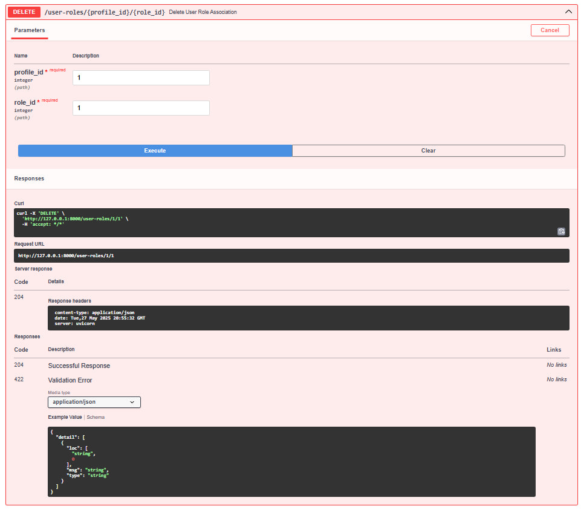
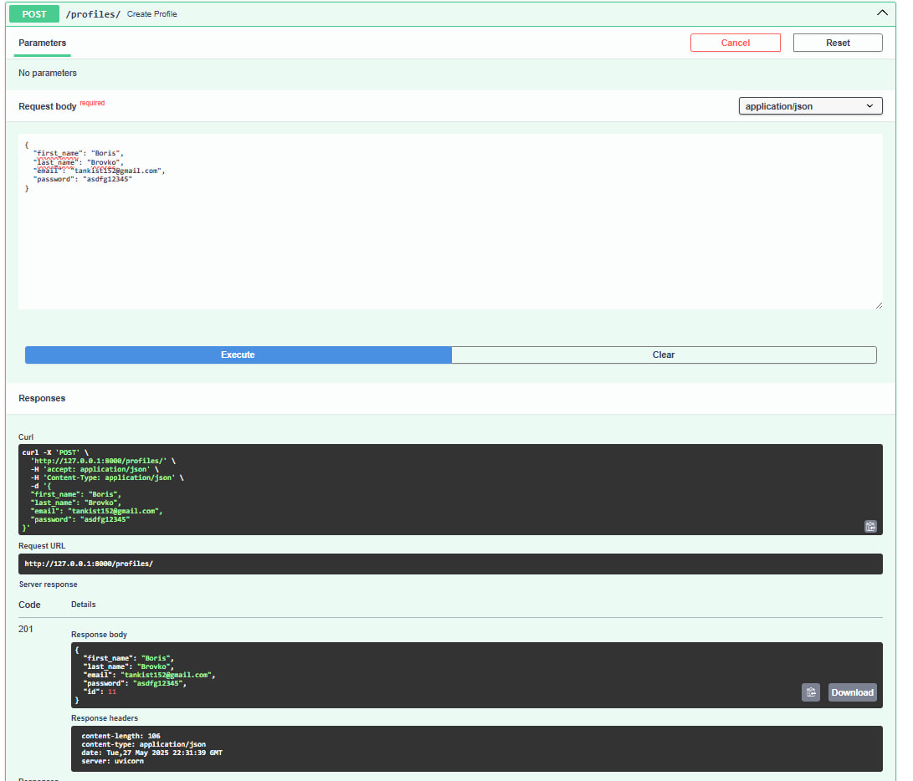
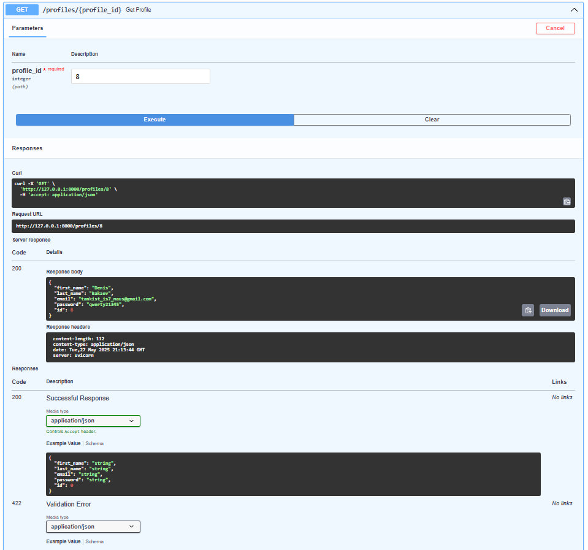

# Тестування працездатності системи

*В цьому розділі необхідно вказати засоби тестування, навести вихідні коди тестів та результати тестування.*

## Передумови 

### 1 - Встановити залежності проекту:

```bash
pip install -r requirements.txt
```

### 2 - Запустити сервер:
```bash
uvicorn app.main:app 
```

## Тестування функціонування сервісів

### GET: Отримати список всіх зв'язків користувач-роль


### POST: Створити зв'язок "користувач-роль"


### GET: Отримати конкретний зв'язок "користувач-роль" за Profile ID та Role ID


### DELETE: Видалити зв'язок "користувач-роль"


### GET: Отримати список всіх профілів


### POST: Створити новий профіль


### GET: Отримати профіль за ID


### PUT: Оновити профіль за ID


### DELETE: Видалити профіль за ID

