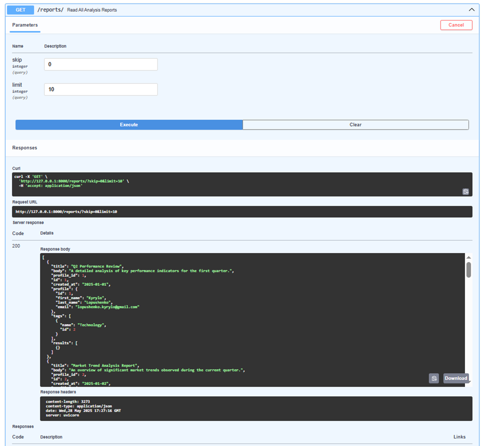
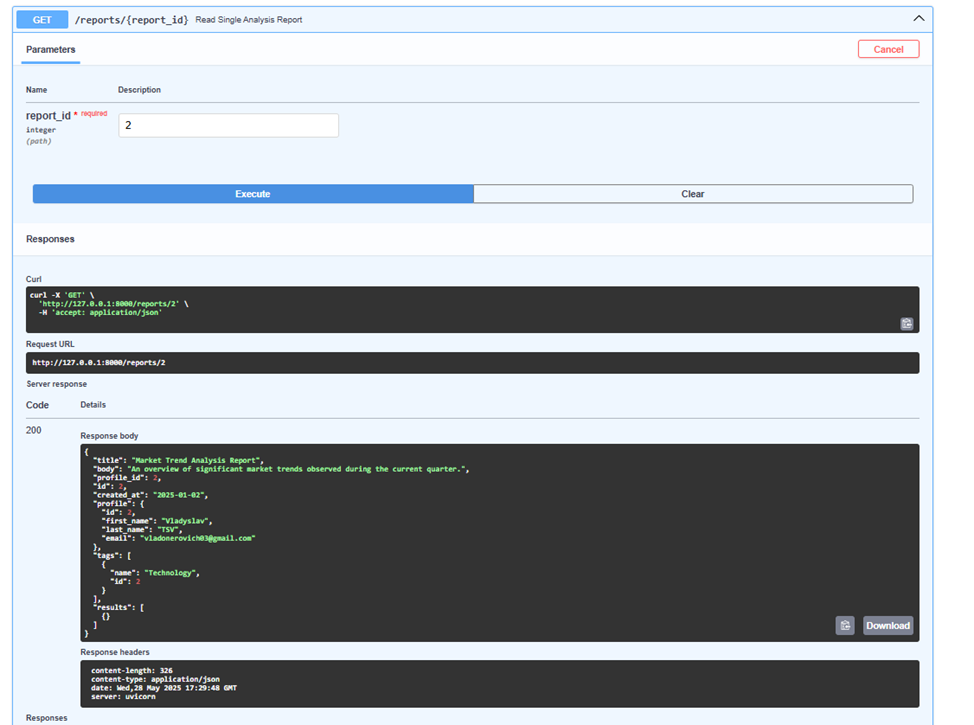
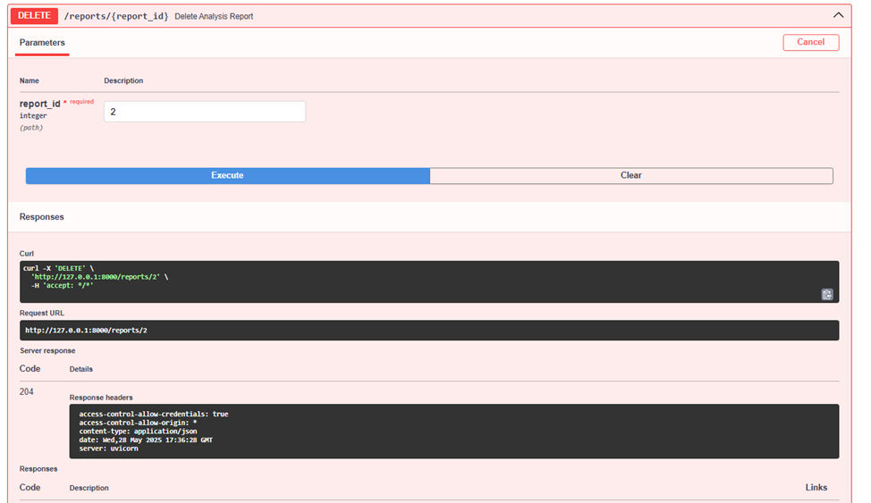
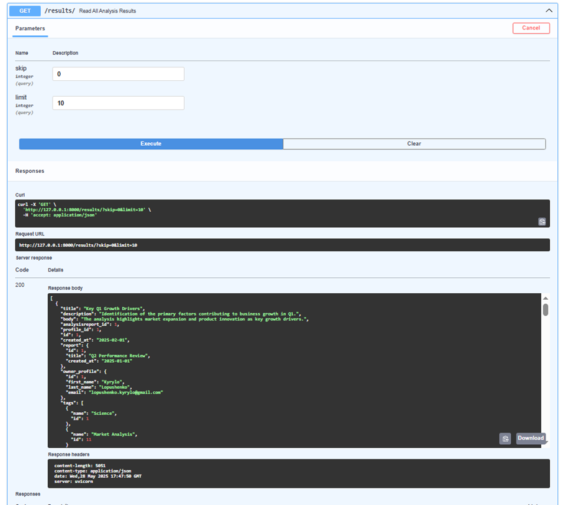
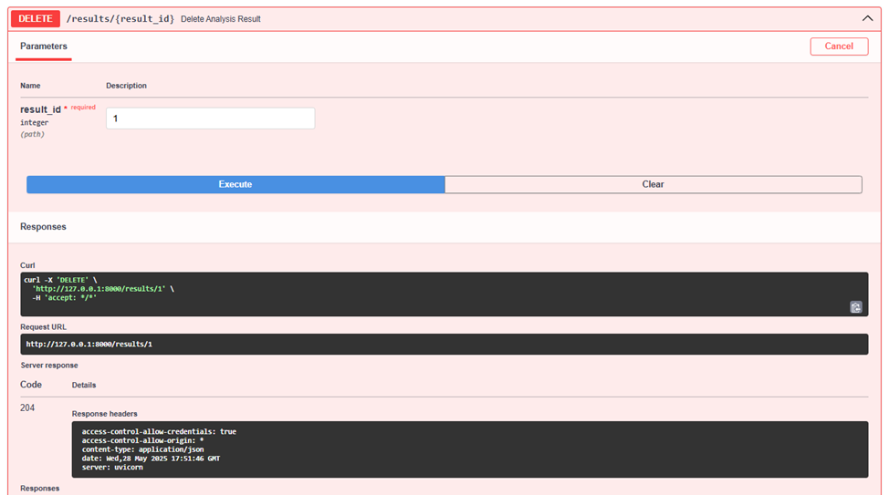

# Тестування працездатності системи

*В цьому розділі необхідно вказати засоби тестування, навести вихідні коди тестів та результати тестування.*

## Передумови 

### 1 - Встановити залежності проекту:

```bash
pip install -r requirements.txt
```

### 2 - Запустити сервер:
```bash
uvicorn app.main:app --reload

```

## Тестування функціонування сервісів

## Analysis Reports

### POST /reports/ Create Analysis Report


### GET /reports/ Read All Analysis Reports


### GET /reports/{report_id} Read Single Analysis Report


### PUT /reports/{report_id} Update Analysis Report


### DELETE /reports/{report_id} Delete Analysis Report


## Analysis Results

### POST /results/ Create Analysis Result


### GET /results/ Read All Analysis Results


### GET /results/{result_id} Read Single Analysis Result


### PUT /results/{result_id} Update Analysis Result


### DELETE /results/{result_id} Delete Analysis Result

