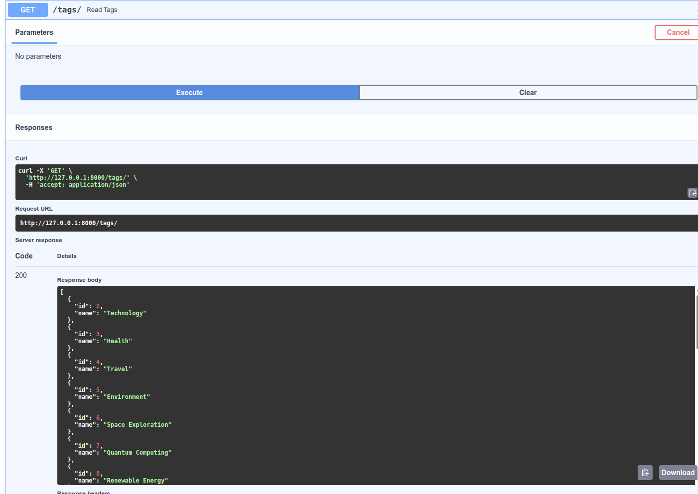
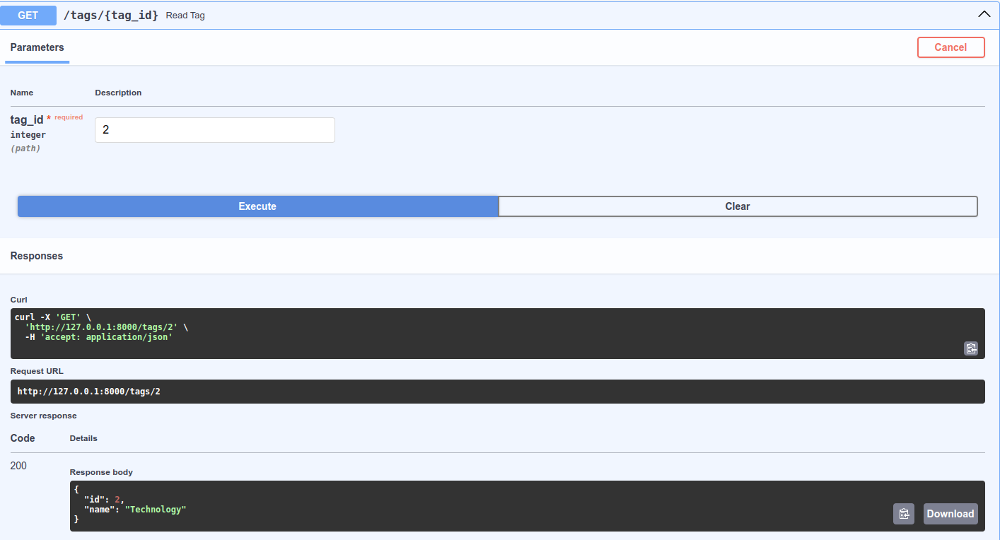
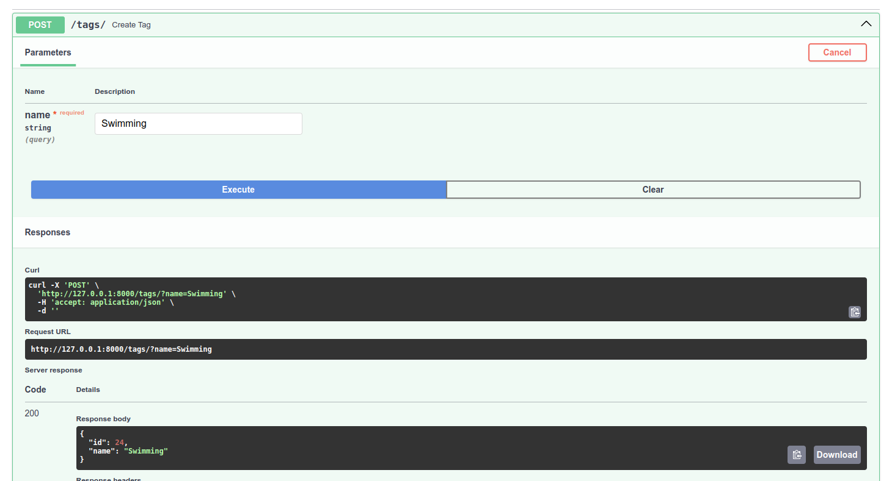
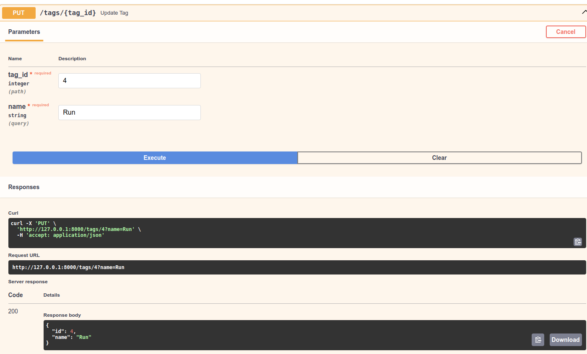
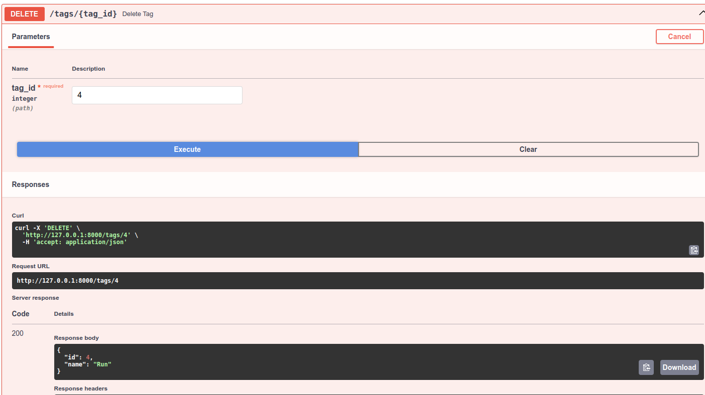
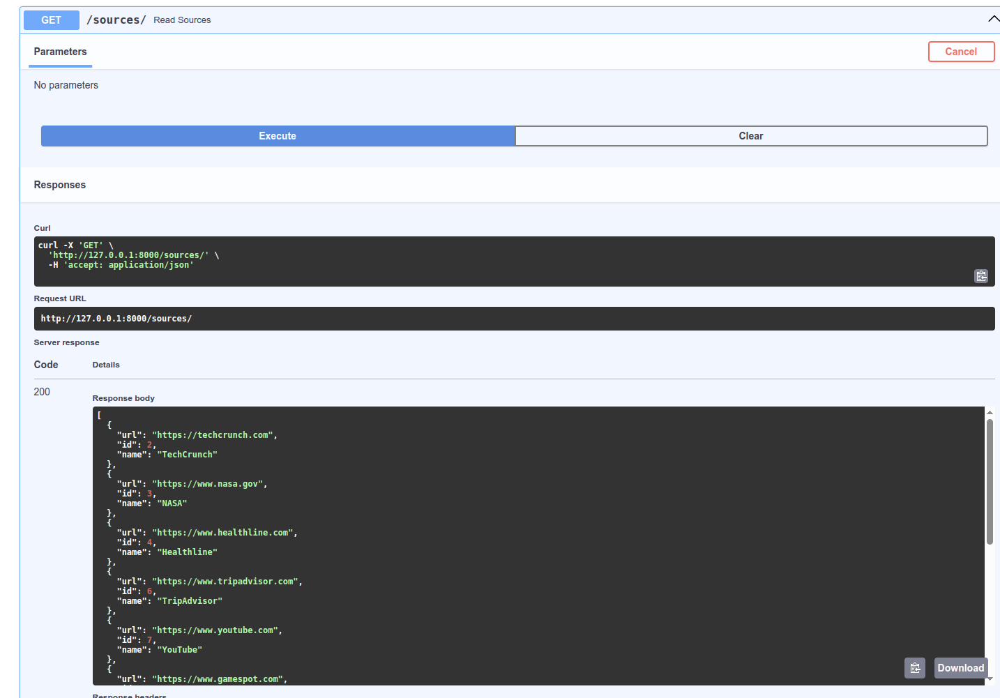
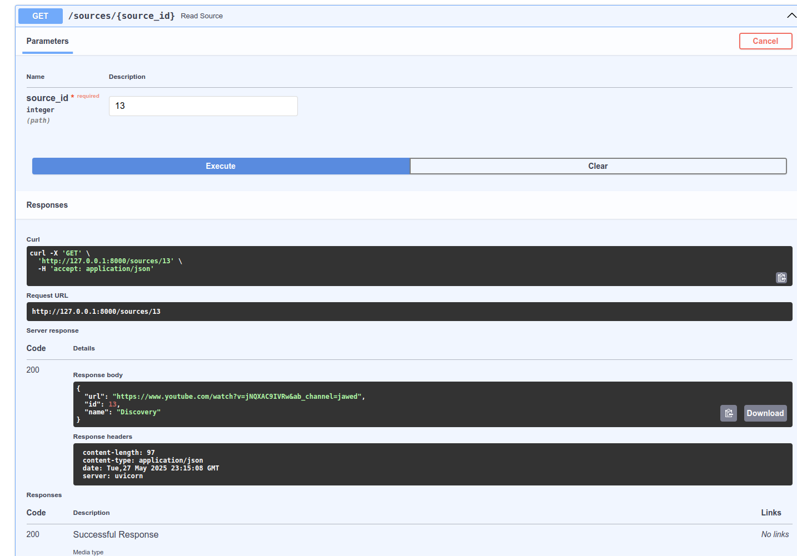
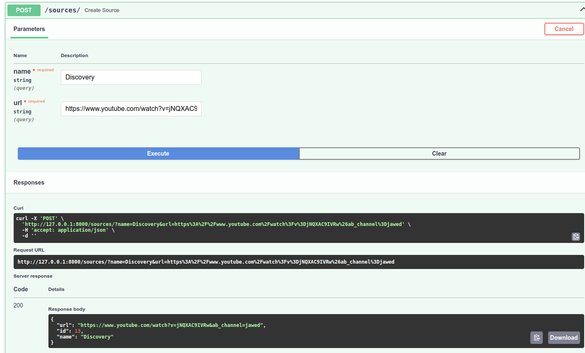
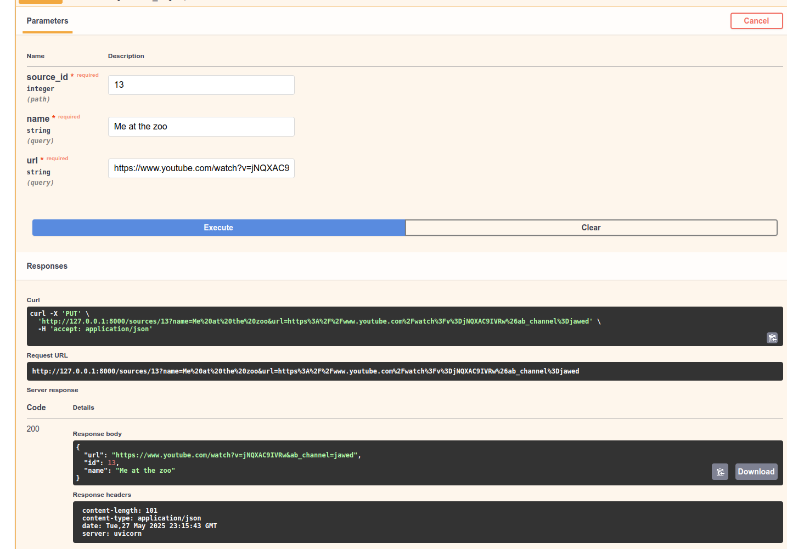

# Тестування працездатності системи

*В цьому розділі необхідно вказати засоби тестування, навести вихідні коди тестів та результати тестування.*

## Передумови 

### 1 - Встановити залежності проекту:

```bash
pip install -r requirements.txt
```

### 2 - Запустити сервер:
```bash
uvicorn app.main:app 
```

## Тестування функціонування сервісів

### GET: Отримати список усіх елементів тегів


### GET: Отримати тег за ID


### POST: Створити новий тег


### PUT: Оновити існуючий тег


### DELETE: Видалити тег за ID


### GET: Отримати список усіх елементів джерела


### GET: Отримати джерело за ID


### POST: Створити нове джерело


### PUT: Оновити існуюче джерело


### DELETE: Видалити джерело за ID
