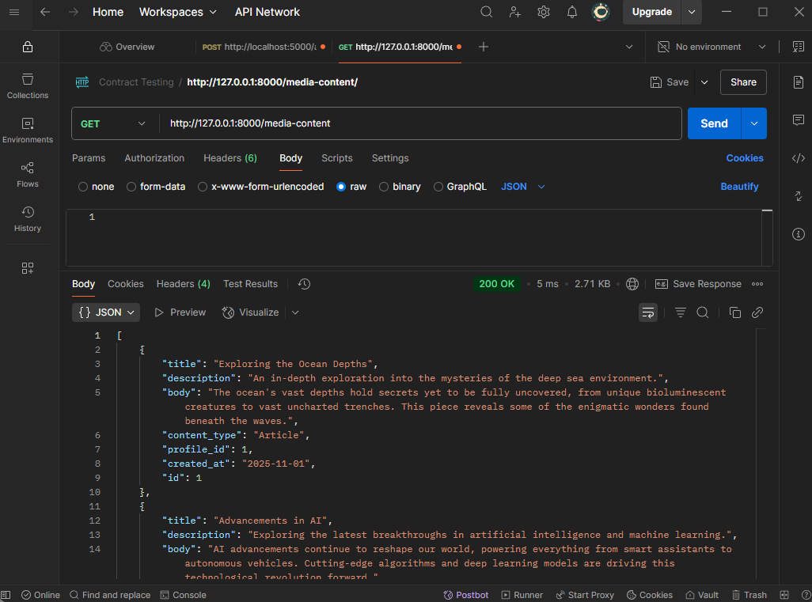
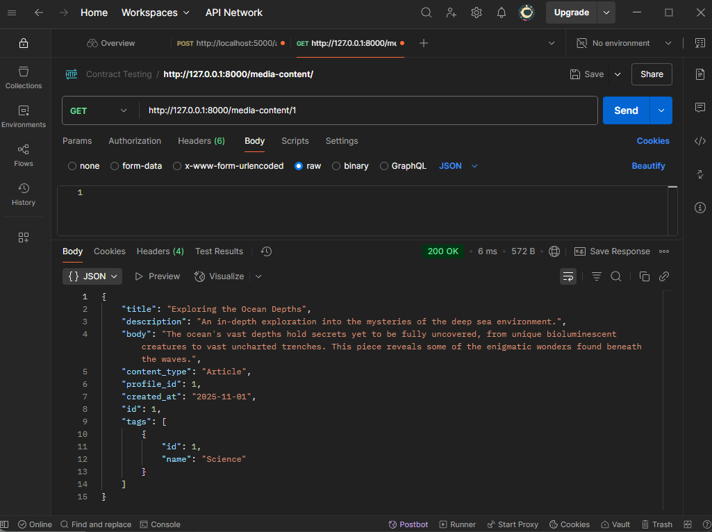
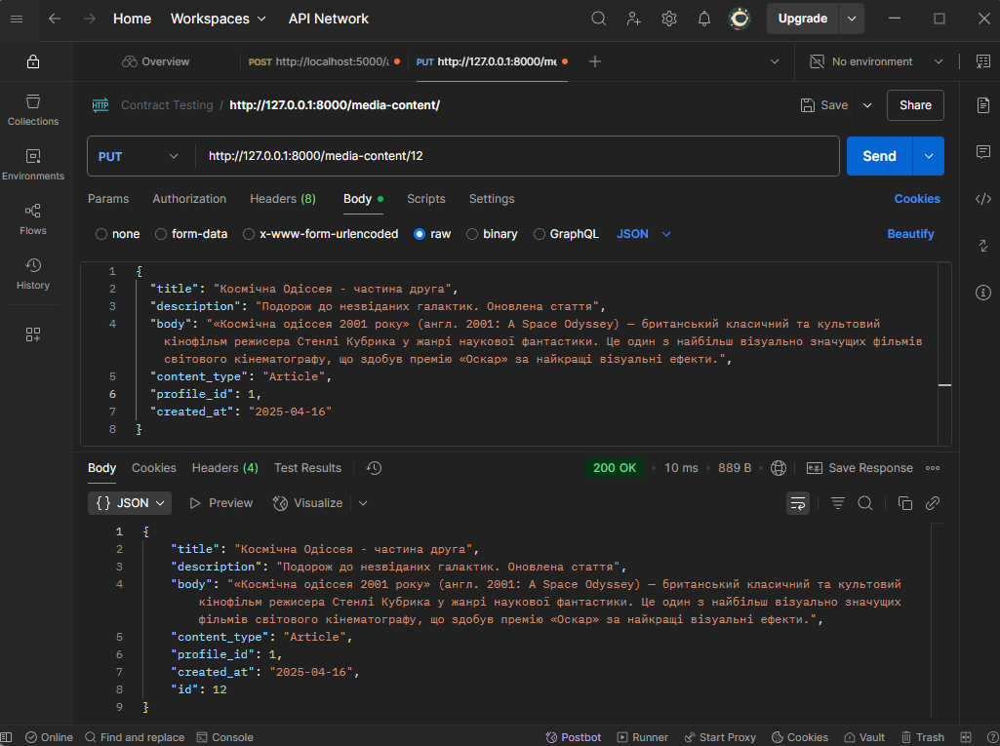
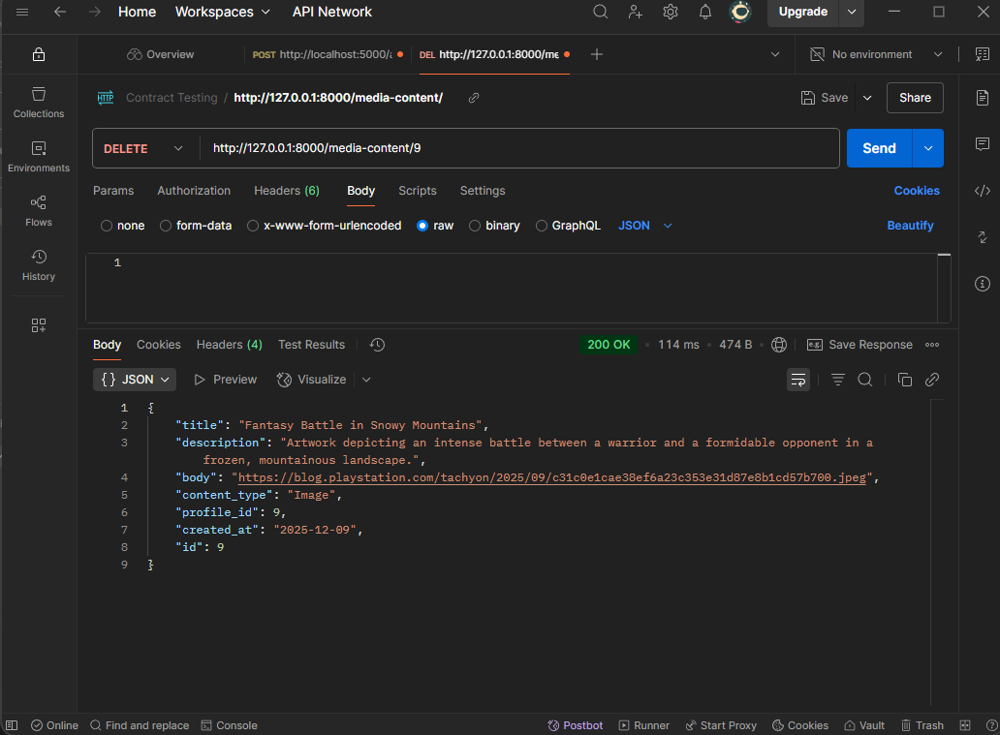
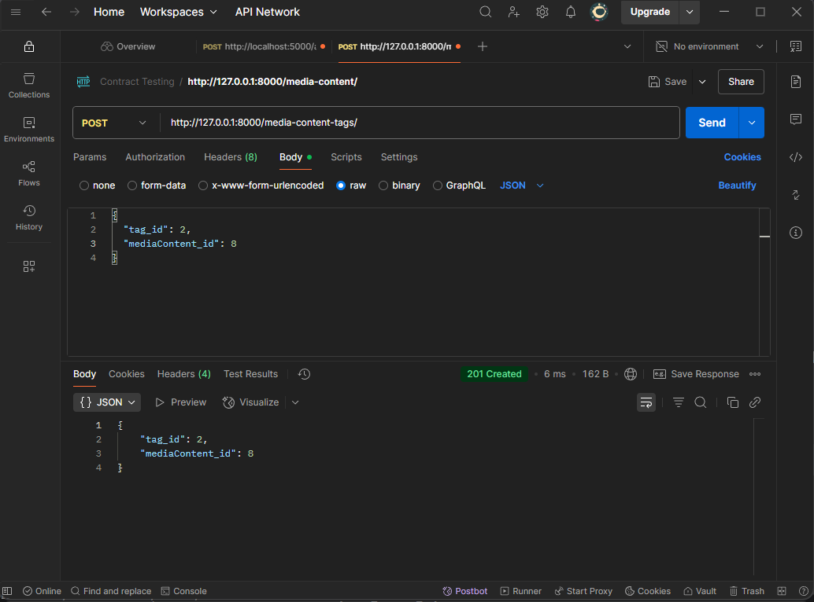
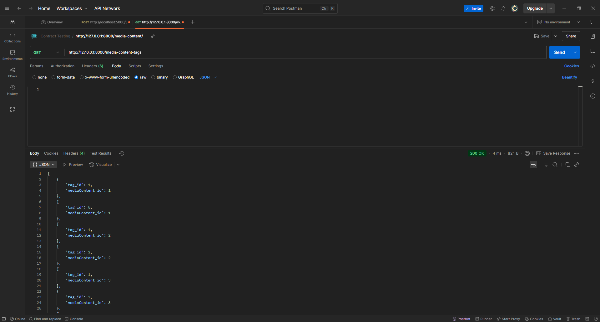
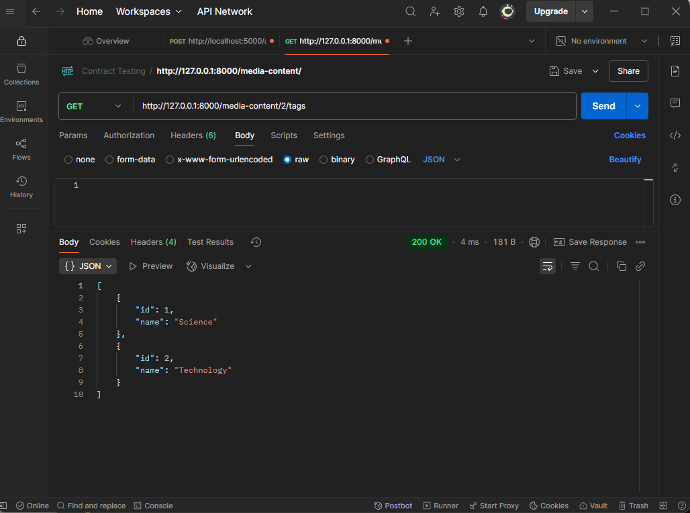
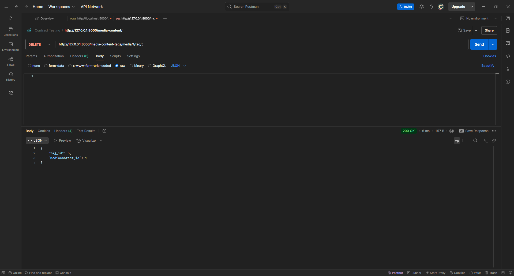

# Тестування працездатності системи

*В цьому розділі необхідно вказати засоби тестування, навести вихідні коди тестів та результати тестування.*

## Передумови 

### 1 - Встановити залежності проекту:

```bash
pip install -r requirements.txt
```

### 2 - Запустити сервер:
```bash
uvicorn app.main:app 
```

## Тестування функціонування сервісів

### GET: Отримати список усіх елементів медіаконтенту


### GET: Отримати медіаконтент за ID


### POST: Створити новий медіаконтент


### PUT: Оновити існуючий медіаконтент


### DELETE: Видалити медіаконтент за ID


### POST: Зв'язати Тег з елементом Медіаконтенту


### GET: Отримати всі зв'язки між Медіаконтентом та Тегами


### GET: Отримати всі теги, пов'язані з конкретним елементом Медіаконтенту


### DELETE: Видалити конкретний зв'язок між елементом Медіаконтенту та Тегом

